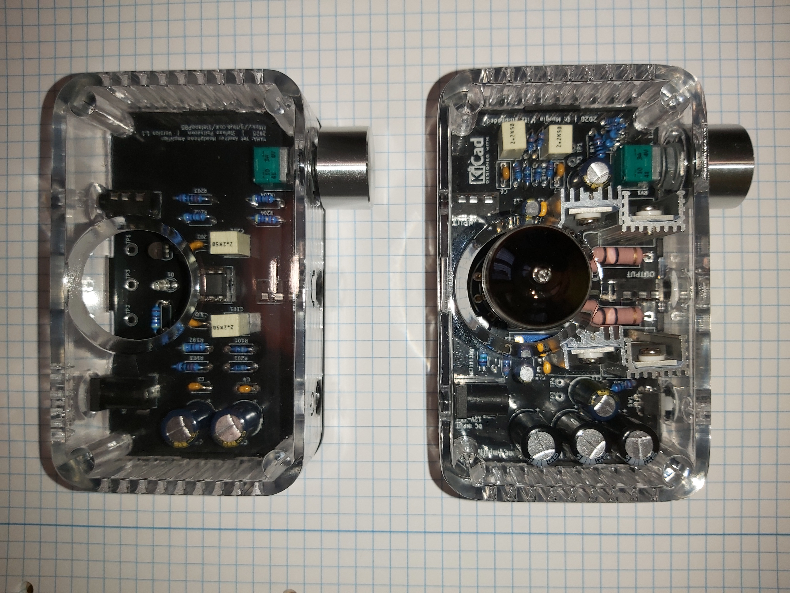

# YAHA
YAHA: Yet Another Headphone Amplifier

This is my first electronic project, a simple headphone amplifier, clerly inspired by the TubeAmp from Dario Murgia's repository @ [https://github.com/Darmur/tubeamp]. I designed it, to fit in the same enclosure too.

| Reference | Quantity | Description | Mouser part number | RS part number | AliExpress |
| --------- | -------- | ----------- | ------------------ | -------------- | ---------- |
| R1, R102, R202|3|Resistore 4,7 KΩ 0,25 W|603-MFR-25FBF52-4K7|199-7625|
| R101, R201|2|Resistore 1 MΩ 0,25 W|603-MFR-25FBF52-1M|199-5032|
| R103, R203|2|Resistore 1 KΩ 0,25 W|603-MFR-25FBF52-1K|199-7601|
| R104, R204|2|Resistore 47 Ω 0,25 W|603-MFR-25FBF52-47R|199-7623|
| RV1|1|Potenziometro doppio audio 50 KΩ|688-RK09712200HA|249-9159|
| C1, C2|2|Condensatore elettrolitico 470 µF 16V|667-EEU-FC1C471B|249-1338|
| C3, C4|2|Condensatore ceramico multistrato 100nF 50V|594-K104K15X7RF5TH5|852-3277|
| C101, C201|2|Condensatore a film 2,2 µF 50V|80-R82CC4220Z370K |171-9233|
| C102, C202|2|Condensatore a film 1 nF 50V|594-K102K10X7RF53H5|240-4836|
| D1|1|LED rosso 3 mm|604-WP710A10SURC/E|619-4886|
| IC1|1|OPA2134PA|595-OPA2134PA|285-8069|
| IC2|1|TLE2426CLP|595-TLE2426CLPR||
| |1|Socket DIP-8|649-DILB8P223TLF|863-2734|
| |1|Connettore DC|710-694108301002|122-4883|https://www.aliexpress.com/item/33005175186.html
| |2|Jack audio 1/8" stereo 3P PJ-320A|||https://www.aliexpress.com/item/33029465106.html
| |1|Manopola per potenziometro|450-225||

Pictures of the components.

PCB back: the red one is the prototype, the black one is the current version.

PCB front: the red one is the prototype, the black one is the current version.

PCB assembled.

Amplifier completed, with the 3D printed enclosure.

The YAHA next to the TubeAmp from Dario Murgia.

